<picture>
  <source media="(prefers-color-scheme: dark)" srcset="assets/loop-final-dark.svg">
  
</picture>

<p align="center">
  <a href="https://MominBinShahid.github.io"></a>
  <a href="https://MominBinShahid.github.io/resume"></a>
  <a href="https://linkedin.com/in/MominBinShahid"></a>
  <a href="mailto:MominBinShahid@gmail.com"></a>
</p>

<picture><source media="(prefers-color-scheme: dark)" srcset="assets/lede-dark.svg"></picture>

<picture><source media="(prefers-color-scheme: dark)" srcset="assets/session-dark.svg"></picture>

Eight years of shipping taught me that the hard part is never the framework. It's
understanding what someone actually needs, then building something that survives contact
with real users. That applies to AI systems more than anything I've worked on before.

<details>
<summary><b>the session, the stack and the links, as text &nbsp;›</b></summary>
<br>

```console
$ whoami
  staff software engineer @ sastaticket.pk
  builds agents. argues about consciousness.

$ cat now.md
  an agent that analyses every support call and scores it
  python · langchain + langgraph · gemini · claude · aws · gcp
  the model is the easy part.

$ history | tail -5
  edtech · erp/hrms · data security · travel · ai agents
  us · europe · middle east · south asia

$ open /contact
  got an interesting problem? let's build something.
```

**AI** LangChain + LangGraph • Gemini • Claude • GPT • evals
**Languages** JavaScript • TypeScript • Python • SQL
**Frontend** React • Vue • Angular
**Backend** Node.js • Django • GraphQL
**Data** PostgreSQL • MongoDB
**Infra** Docker • Kubernetes • Airflow • AWS • GCP • Azure • Sentry

**Elsewhere** [website](https://MominBinShahid.github.io) • [resume](https://MominBinShahid.github.io/resume) • [linkedin](https://linkedin.com/in/MominBinShahid) • [email](mailto:MominBinShahid@gmail.com)

</details>

<picture><source media="(prefers-color-scheme: dark)" srcset="assets/mk-dot-dark.svg"></picture>

<p align="center">
  <samp>
    Most of what I've built runs in production and isn't on GitHub —
    <a href="https://MominBinShahid.github.io/resume">resume</a> is where it lives.<br>
    Curious about most things. Employed for some of them.
  </samp>
</p>
